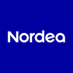
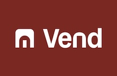
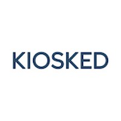
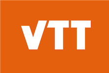
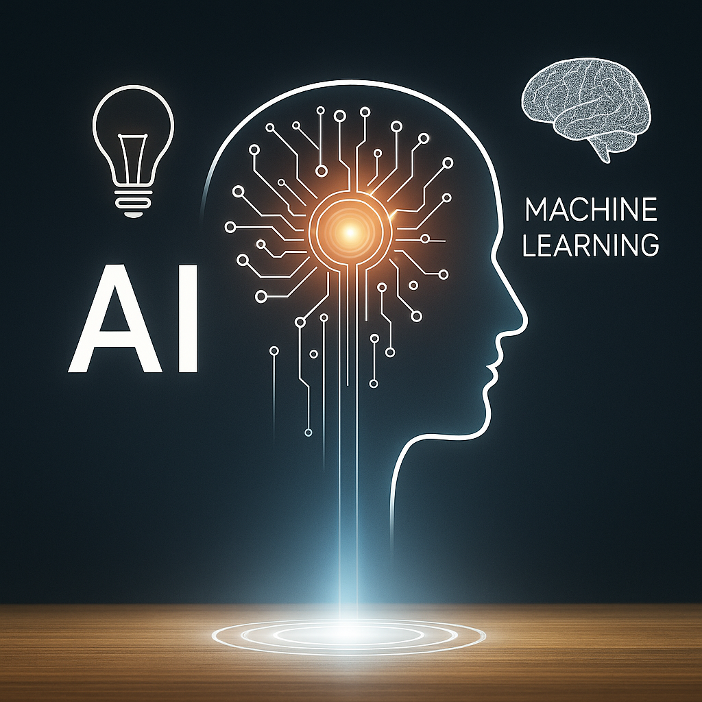

<section class="hero full-bleed" aria-label="Hero">
  <picture>
    <!-- Example hero image reference; replace hero-bg.jpg with an optimized asset placed under /assets/img/ -->
    <source srcset="/assets/img/hero-bg-light-blue.png" type="image/png" />
    
  </picture>
  

    
MXM CONSULTING

  <h1>Architecting Cloud, Scale & AI Systems</h1>
  
Strategic cloud migrations, resilient software architecture, and production-grade AI integration. 15+ years of engineering excellence de-risking technology decisions for enterprise, finance, and SaaS platforms.

  

      <a href="#contact" class="btn accent">Start a Conversation</a>
      <a href="/about/" class="btn outline">About Us</a>
      <a href="/services/" class="btn outline">View Services</a>
    

  

</section>

<section class="section alt" aria-labelledby="clients-heading">
  

    <h2 id="clients-heading" class="mb-3">Trusted by forward-thinking companies</h2>
    

      
      
      
      
      
      
      
      
      
      
    

  

</section>

<section class="section" aria-labelledby="why-heading">
  

    <h2 id="why-heading">Why Partner with MXM Consulting?</h2>
  

      

        
⚙️

        <h3>Architecture & Cloud</h3>
        
Designing resilient, scalable distributed systems on AWS & Google Cloud, including high-throughput LLM pipelines and semantic search infrastructure.

      

      

        
🧭

        <h3>Technical Due Diligence</h3>
        
Clear, evidence-based assessments for investors & leadership: architecture velocity, AI/ML risk posture, intellectual property, and strategic scaling options.

      

      

        
🚀

        <h3>Applied AI & Acceleration</h3>
        
Operationalizing LLMs, agentic workflows, and semantic caching, while aligning roadmaps and unblocking product delivery teams.

      

    

  

</section>

<section class="section alt" aria-labelledby="differentiators-heading">
  

    <h2 id="differentiators-heading">What Sets Us Apart</h2>
  

      
<h3>15+ Years Experience</h3>
Broad transformations & platform builds spanning finance, marketplaces, media, analytics & SaaS.

      
<h3>Client-First Focus</h3>
No vendor bias. Independent, pragmatic recommendations aligned to measurable outcomes.

      
<h3>Systems Thinking</h3>
Architecture decisions mapped to business levers: time-to-market, resilience, run costs & adaptability.

    

  

</section>

<section class="section" aria-labelledby="expertise-heading">
  

    <h2 id="expertise-heading" class="mb-2">Our Comprehensive IT Expertise & Services</h2>
    
From cloud foundations to intelligent automation, we combine architectural rigor with delivery pragmatism. Explore the core capabilities that enable sustainable technology velocity.

    

      <button class="slideshow-nav prev" onclick="slideshow.prev()" aria-label="Previous service">
        ‹
      </button>
      

        

          <!-- existing slides preserved -->
          

            

              
              <h3>Cloud Services</h3>
              
AWS & Google Cloud scale, IaC, Kubernetes, and serverless compute

            

          

          

            

              
              <h3>Software Architecture</h3>
              
Event-driven microservices, clean API lifecycles, and scalable data models

            

          

          

            

              
              <h3>App Development</h3>
              
High-performance web applications, native mobile apps, and rich interactive frontends

            

          

          

            

              
              <h3>AI & Agentic Systems</h3>
              
Designing custom RAG architectures, multi-agent workflows, and LLMOps evaluation loops

            

          

          

            

              
              <h3>Automation & Platform</h3>
              
CI/CD golden paths, developer experience, and automated policy-as-code

            

          

          

            

              
              <h3>Technology Leadership</h3>
              
Fractional CTO advisory, technical due diligence, and team capability uplift

            

          

        

      

      <button class="slideshow-nav next" onclick="slideshow.next()" aria-label="Next service">
        ›
      </button>
      

        <button role="tab" aria-label="Go to slide 1" onclick="slideshow.goToSlide(0)"></button>
        <button role="tab" aria-label="Go to slide 2" onclick="slideshow.goToSlide(1)"></button>
        <button role="tab" aria-label="Go to slide 3" onclick="slideshow.goToSlide(2)"></button>
        <button role="tab" aria-label="Go to slide 4" onclick="slideshow.goToSlide(3)"></button>
        <button role="tab" aria-label="Go to slide 5" onclick="slideshow.goToSlide(4)"></button>
        <button role="tab" aria-label="Go to slide 6" onclick="slideshow.goToSlide(5)"></button>
      

    

    

    
<strong>Technologies & Principles:</strong>

    Some of the principles and technologies we have experience with, but are not limited to:
    

    <ul>
      <li>GenAI & LLM applications - RAG, LangChain, LangGraph, LlamaIndex</li>
      <li>Vector databases & semantic caching - pgvector, Qdrant, Pinecone, Redis</li>
      <li>Event-driven architecture (EDA) - Kafka, Google Cloud Pub/Sub</li>
      <li>Monoliths & microservices - Kubernetes, ECS/Fargate, API Gateways</li>
      <li>Data infrastructure - BigQuery, Cloud Storage, PostgreSQL</li>
      <li>Infrastructure as Code (IaC) - Terraform, AWS CDK, Pulumi</li>
      <li>Observability & telemetry - OpenTelemetry, Prometheus, Grafana</li>
      <li>Structured data extraction & validation - Pydantic, Instructor</li>
    </ul>
  

</section>

<!-- Duplicate legacy slideshow removed -->

<section class="section gradient-dark" id="contact" aria-labelledby="contact-heading">
  

    <h2 id="contact-heading">Get Started with Professional IT Consulting</h2>
    
Let's explore how we can help you de-risk decisions and accelerate delivery. <strong>Complimentary first consultation included.</strong> Reach out and we'll respond promptly.

    <form
      action="https://formspree.io/f/xyzgwzaq"
      method="POST"
      class="contact-form"
    >
      <label for="email">Your email</label>
      <input type="email" id="email" name="email" autocomplete="email" required>
      <label for="message">Your message</label>
      <textarea id="message" name="message" required></textarea>
  <button type="submit" class="submit-button btn accent">Send Message</button>
    </form>
  

</section>

